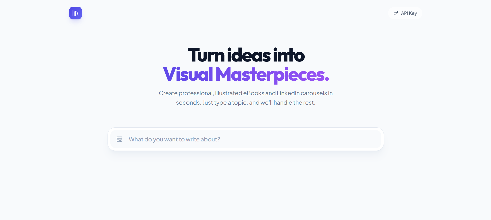

# 📚 eBook Architect

**eBook Architect** is a powerful AI-driven web application that transforms simple topics into professional, illustrated eBooks and LinkedIn Carousels. 

Powered by **Google Gemini 3 Pro** for deep, engaging content and **Gemini 2.5 Flash Image** for stunning visuals, it allows users to architect knowledge into beautiful, downloadable formats in minutes.



## ✨ Key Features

- **🤖 Dual-AI Engine**: Uses `gemini-3-pro-preview` for high-quality, long-form writing and `gemini-2.5-flash-image` for consistent, artistic illustrations.
- **🎨 Interactive Diagrams**: Automatically generates complex data structures and flows as interactive SVG diagrams that users can zoom and pan.
- **📱 Multi-Format Support**: 
  - **Standard eBook**: Comprehensive chapters with narrative flow.
  - **LinkedIn Carousel**: Punchy, slide-based content optimized for social engagement.
- **🔍 Google Search Grounding**: toggleable option to fetch real-time, factual data for accurate non-fiction writing.
- **📄 Client-Side PDF Export**: Generates high-fidelity PDFs directly in the browser using `html2canvas` and `jspdf`, preserving layout and illustrations.
- **✏️ Live Editor**: Review, edit, and refine content before finalizing your book.
- **🔐 Secure API Management**: Bring your own Key (BYOK) architecture. API keys are stored locally in your browser's localStorage.

## 🛠️ Tech Stack

- **Frontend**: React 19, TypeScript, Tailwind CSS
- **AI Integration**: Google GenAI SDK (`@google/genai`)
- **State Management**: React Hooks
- **Rendering & Export**: `react-markdown`, `html2canvas`, `jspdf`
- **Icons**: Lucide React

## 🚀 Getting Started

### Prerequisites

- Node.js (v18 or higher)
- A Google Gemini API Key (Get one at [Google AI Studio](https://aistudio.google.com/app/apikey))

### Installation

1. **Clone the repository**
   ```bash
   git clone https://github.com/yourusername/ebook-architect.git
   cd ebook-architect
   ```

2. **Install dependencies**
   ```bash
   npm install
   ```

3. **Start the development server**
   ```bash
   npm start
   ```

## ⚙️ Configuration

You can configure the API key in two ways:

1. **UI Configuration (Recommended)**: 
   - Click the **"Add API Key"** button in the top right corner of the app.
   - Enter your key. It will be saved securely to your browser's Local Storage.

2. **Environment Variable**:
   - Create a `.env` file in the root directory.
   - Add: `API_KEY=your_gemini_api_key_here`

## 📖 How to Use

1. **Define your Topic**: Enter a subject (e.g., "The Future of Quantum Computing").
2. **Customize**: 
   - Select **Format** (eBook vs Carousel).
   - Set **Author Name**, **Audience**, and **Tone**.
   - Choose an **Illustration Style** (e.g., Cyberpunk, Minimalist, Watercolor).
   - Adjust the **Chapter Count** slider.
3. **Architect**: Click "Generate Outline". The AI will propose a structure.
4. **Refine**: Edit chapter titles or descriptions if needed.
5. **Generate**: Click "Generate Book". Watch as the AI writes text and draws illustrations in real-time.
6. **Read & Export**: Use the reader view to browse your book, interact with diagrams, and click **"Download PDF"** to save your masterpiece.

## 🤝 Contributing

Contributions are welcome! Please feel free to submit a Pull Request.
